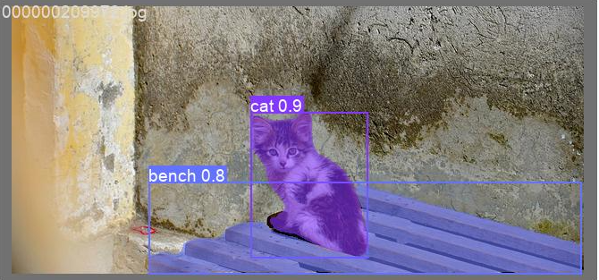

# yolov7

Implementation of "YOLOv7: Trainable bag-of-freebies sets new state-of-the-art for real-time object detectors"

This implimentation is based on [yolov5](https://github.com/ultralytics/yolov5).

All of installation, data preparation, and usage are as same as yolov5.

## Training

``` shell
python segment/train.py --data coco.yaml --batch 16 --weights '' --cfg yolov7-seg.yaml --epochs 300 --name yolov7-seg --img 640 --hyp hyp.scratch-high.yaml
```

## Results

[`yolov7-seg.pt`](https://github.com/WongKinYiu/yolov7/releases/download/v0.1/yolov7-seg.pt)

```
Object detection:
 Average Precision  (AP) @[ IoU=0.50:0.95 | area=   all | maxDets=100 ] = 0.49629
 Average Precision  (AP) @[ IoU=0.50      | area=   all | maxDets=100 ] = 0.67746
 Average Precision  (AP) @[ IoU=0.75      | area=   all | maxDets=100 ] = 0.53842
 Average Precision  (AP) @[ IoU=0.50:0.95 | area= small | maxDets=100 ] = 0.32679
 Average Precision  (AP) @[ IoU=0.50:0.95 | area=medium | maxDets=100 ] = 0.55475
 Average Precision  (AP) @[ IoU=0.50:0.95 | area= large | maxDets=100 ] = 0.63948
 Average Recall     (AR) @[ IoU=0.50:0.95 | area=   all | maxDets=  1 ] = 0.37569
 Average Recall     (AR) @[ IoU=0.50:0.95 | area=   all | maxDets= 10 ] = 0.61747
 Average Recall     (AR) @[ IoU=0.50:0.95 | area=   all | maxDets=100 ] = 0.66796
 Average Recall     (AR) @[ IoU=0.50:0.95 | area= small | maxDets=100 ] = 0.49381
 Average Recall     (AR) @[ IoU=0.50:0.95 | area=medium | maxDets=100 ] = 0.72859
 Average Recall     (AR) @[ IoU=0.50:0.95 | area= large | maxDets=100 ] = 0.81632

Instance segmentation:
 Average Precision  (AP) @[ IoU=0.50:0.95 | area=   all | maxDets=100 ] = 0.40531
 Average Precision  (AP) @[ IoU=0.50      | area=   all | maxDets=100 ] = 0.64003
 Average Precision  (AP) @[ IoU=0.75      | area=   all | maxDets=100 ] = 0.42996
 Average Precision  (AP) @[ IoU=0.50:0.95 | area= small | maxDets=100 ] = 0.22329
 Average Precision  (AP) @[ IoU=0.50:0.95 | area=medium | maxDets=100 ] = 0.46102
 Average Precision  (AP) @[ IoU=0.50:0.95 | area= large | maxDets=100 ] = 0.56453
 Average Recall     (AR) @[ IoU=0.50:0.95 | area=   all | maxDets=  1 ] = 0.32220
 Average Recall     (AR) @[ IoU=0.50:0.95 | area=   all | maxDets= 10 ] = 0.51069
 Average Recall     (AR) @[ IoU=0.50:0.95 | area=   all | maxDets=100 ] = 0.54511
 Average Recall     (AR) @[ IoU=0.50:0.95 | area= small | maxDets=100 ] = 0.34929
 Average Recall     (AR) @[ IoU=0.50:0.95 | area=medium | maxDets=100 ] = 0.61070
 Average Recall     (AR) @[ IoU=0.50:0.95 | area= large | maxDets=100 ] = 0.72177
```

[`yolov7x-seg.pt`](https://github.com/WongKinYiu/yolov7/releases/download/v0.1/yolov7x-seg.pt)

```
Object detection:
 Average Precision  (AP) @[ IoU=0.50:0.95 | area=   all | maxDets=100 ] = 0.51650
 Average Precision  (AP) @[ IoU=0.50      | area=   all | maxDets=100 ] = 0.69517
 Average Precision  (AP) @[ IoU=0.75      | area=   all | maxDets=100 ] = 0.56113
 Average Precision  (AP) @[ IoU=0.50:0.95 | area= small | maxDets=100 ] = 0.34761
 Average Precision  (AP) @[ IoU=0.50:0.95 | area=medium | maxDets=100 ] = 0.57255
 Average Precision  (AP) @[ IoU=0.50:0.95 | area= large | maxDets=100 ] = 0.66059
 Average Recall     (AR) @[ IoU=0.50:0.95 | area=   all | maxDets=  1 ] = 0.38840
 Average Recall     (AR) @[ IoU=0.50:0.95 | area=   all | maxDets= 10 ] = 0.63697
 Average Recall     (AR) @[ IoU=0.50:0.95 | area=   all | maxDets=100 ] = 0.68754
 Average Recall     (AR) @[ IoU=0.50:0.95 | area= small | maxDets=100 ] = 0.51488
 Average Recall     (AR) @[ IoU=0.50:0.95 | area=medium | maxDets=100 ] = 0.74506
 Average Recall     (AR) @[ IoU=0.50:0.95 | area= large | maxDets=100 ] = 0.83554

Instance segmentation:
 Average Precision  (AP) @[ IoU=0.50:0.95 | area=   all | maxDets=100 ] = 0.41901
 Average Precision  (AP) @[ IoU=0.50      | area=   all | maxDets=100 ] = 0.65833
 Average Precision  (AP) @[ IoU=0.75      | area=   all | maxDets=100 ] = 0.44483
 Average Precision  (AP) @[ IoU=0.50:0.95 | area= small | maxDets=100 ] = 0.23123
 Average Precision  (AP) @[ IoU=0.50:0.95 | area=medium | maxDets=100 ] = 0.47414
 Average Precision  (AP) @[ IoU=0.50:0.95 | area= large | maxDets=100 ] = 0.58149
 Average Recall     (AR) @[ IoU=0.50:0.95 | area=   all | maxDets=  1 ] = 0.33164
 Average Recall     (AR) @[ IoU=0.50:0.95 | area=   all | maxDets= 10 ] = 0.52327
 Average Recall     (AR) @[ IoU=0.50:0.95 | area=   all | maxDets=100 ] = 0.55738
 Average Recall     (AR) @[ IoU=0.50:0.95 | area= small | maxDets=100 ] = 0.35367
 Average Recall     (AR) @[ IoU=0.50:0.95 | area=medium | maxDets=100 ] = 0.62091
 Average Recall     (AR) @[ IoU=0.50:0.95 | area= large | maxDets=100 ] = 0.74205
```

## Examples

<div align="center">
    <a href="./">
        
    </a>
</div>

## Developing...

[`yolov7-seg-dev.pt`](https://github.com/WongKinYiu/yolov7/releases/download/v0.1/yolov7-seg-dev.pt)

```
Object detection:
 Average Precision  (AP) @[ IoU=0.50:0.95 | area=   all | maxDets=100 ] = 0.51100
 Average Precision  (AP) @[ IoU=0.50      | area=   all | maxDets=100 ] = 0.68832
 Average Precision  (AP) @[ IoU=0.75      | area=   all | maxDets=100 ] = 0.55593
 Average Precision  (AP) @[ IoU=0.50:0.95 | area= small | maxDets=100 ] = 0.34518
 Average Precision  (AP) @[ IoU=0.50:0.95 | area=medium | maxDets=100 ] = 0.56570
 Average Precision  (AP) @[ IoU=0.50:0.95 | area= large | maxDets=100 ] = 0.65318
 Average Recall     (AR) @[ IoU=0.50:0.95 | area=   all | maxDets=  1 ] = 0.38180
 Average Recall     (AR) @[ IoU=0.50:0.95 | area=   all | maxDets= 10 ] = 0.63630
 Average Recall     (AR) @[ IoU=0.50:0.95 | area=   all | maxDets=100 ] = 0.68619
 Average Recall     (AR) @[ IoU=0.50:0.95 | area= small | maxDets=100 ] = 0.52338
 Average Recall     (AR) @[ IoU=0.50:0.95 | area=medium | maxDets=100 ] = 0.74392
 Average Recall     (AR) @[ IoU=0.50:0.95 | area= large | maxDets=100 ] = 0.82744

Instance segmentation:
 Average Precision  (AP) @[ IoU=0.50:0.95 | area=   all | maxDets=100 ] = 0.41422
 Average Precision  (AP) @[ IoU=0.50      | area=   all | maxDets=100 ] = 0.65154
 Average Precision  (AP) @[ IoU=0.75      | area=   all | maxDets=100 ] = 0.44169
 Average Precision  (AP) @[ IoU=0.50:0.95 | area= small | maxDets=100 ] = 0.23393
 Average Precision  (AP) @[ IoU=0.50:0.95 | area=medium | maxDets=100 ] = 0.46379
 Average Precision  (AP) @[ IoU=0.50:0.95 | area= large | maxDets=100 ] = 0.57722
 Average Recall     (AR) @[ IoU=0.50:0.95 | area=   all | maxDets=  1 ] = 0.32766
 Average Recall     (AR) @[ IoU=0.50:0.95 | area=   all | maxDets= 10 ] = 0.52457
 Average Recall     (AR) @[ IoU=0.50:0.95 | area=   all | maxDets=100 ] = 0.55851
 Average Recall     (AR) @[ IoU=0.50:0.95 | area= small | maxDets=100 ] = 0.35866
 Average Recall     (AR) @[ IoU=0.50:0.95 | area=medium | maxDets=100 ] = 0.61833
 Average Recall     (AR) @[ IoU=0.50:0.95 | area= large | maxDets=100 ] = 0.74352
```

update yolor modling

```
Object detection:
 Average Precision  (AP) @[ IoU=0.50:0.95 | area=   all | maxDets=100 ] = 0.51384
 Average Precision  (AP) @[ IoU=0.50      | area=   all | maxDets=100 ] = 0.69383
 Average Precision  (AP) @[ IoU=0.75      | area=   all | maxDets=100 ] = 0.55794
 Average Precision  (AP) @[ IoU=0.50:0.95 | area= small | maxDets=100 ] = 0.34061
 Average Precision  (AP) @[ IoU=0.50:0.95 | area=medium | maxDets=100 ] = 0.56557
 Average Precision  (AP) @[ IoU=0.50:0.95 | area= large | maxDets=100 ] = 0.66566
 Average Recall     (AR) @[ IoU=0.50:0.95 | area=   all | maxDets=  1 ] = 0.38459
 Average Recall     (AR) @[ IoU=0.50:0.95 | area=   all | maxDets= 10 ] = 0.63617
 Average Recall     (AR) @[ IoU=0.50:0.95 | area=   all | maxDets=100 ] = 0.68621
 Average Recall     (AR) @[ IoU=0.50:0.95 | area= small | maxDets=100 ] = 0.52662
 Average Recall     (AR) @[ IoU=0.50:0.95 | area=medium | maxDets=100 ] = 0.73997
 Average Recall     (AR) @[ IoU=0.50:0.95 | area= large | maxDets=100 ] = 0.83435

Instance segmentation:
 Average Precision  (AP) @[ IoU=0.50:0.95 | area=   all | maxDets=100 ] = 0.41483
 Average Precision  (AP) @[ IoU=0.50      | area=   all | maxDets=100 ] = 0.65499
 Average Precision  (AP) @[ IoU=0.75      | area=   all | maxDets=100 ] = 0.43665
 Average Precision  (AP) @[ IoU=0.50:0.95 | area= small | maxDets=100 ] = 0.22629
 Average Precision  (AP) @[ IoU=0.50:0.95 | area=medium | maxDets=100 ] = 0.46021
 Average Precision  (AP) @[ IoU=0.50:0.95 | area= large | maxDets=100 ] = 0.58898
 Average Recall     (AR) @[ IoU=0.50:0.95 | area=   all | maxDets=  1 ] = 0.32963
 Average Recall     (AR) @[ IoU=0.50:0.95 | area=   all | maxDets= 10 ] = 0.52450

'''
   epoch / gpu_mem / train_box_loss / train_obj_loss / train_cls_loss / total / labels /images_size / Precision / Recall / map@.5 / map@.5:.95/ val_box_loss / val_obj_loss / val_cls_loss
     1/299     21.9G   0.03443  0.009371  0.002907   0.04671        71       640    0.7693    0.7497    0.7515    0.4884     0.054   0.01307  0.009545
     2/299     21.4G   0.03107  0.008822   0.00189   0.04178        51       640    0.7493    0.6864    0.7278    0.4685   0.05564   0.01343  0.009897
     3/299     21.4G   0.03144  0.009079  0.001916   0.04243       154       640    0.7425    0.7342    0.7371    0.4643   0.05638   0.01359  0.008954
     4/299     21.4G   0.03115  0.009112  0.001721   0.04199       104       640     0.721     0.763    0.7531    0.4933   0.05331   0.01293  0.008231
     5/299     21.4G      0.03  0.008932   0.00161   0.04054        76       640    0.8122    0.7571    0.7743    0.5107   0.05391   0.01274  0.008425
     6/299     21.4G   0.02915  0.008763  0.001593   0.03951        83       640    0.7819    0.7584    0.7743    0.5164   0.05139   0.01315  0.008047
     7/299     21.4G   0.02866  0.008541  0.001425   0.03863       115       640    0.7802    0.7809    0.7736    0.5247   0.04943   0.01319  0.007946
     8/299     21.4G   0.02809  0.008568  0.001338     0.038        63       640    0.8126    0.7663    0.7869    0.5328   0.04892   0.01352  0.007769
'''
 Average Recall     (AR) @[ IoU=0.50:0.95 | area=   all | maxDets=100 ] = 0.55855
 Average Recall     (AR) @[ IoU=0.50:0.95 | area= small | maxDets=100 ] = 0.36392
 Average Recall     (AR) @[ IoU=0.50:0.95 | area=medium | maxDets=100 ] = 0.61302
 Average Recall     (AR) @[ IoU=0.50:0.95 | area= large | maxDets=100 ] = 0.74983
```
